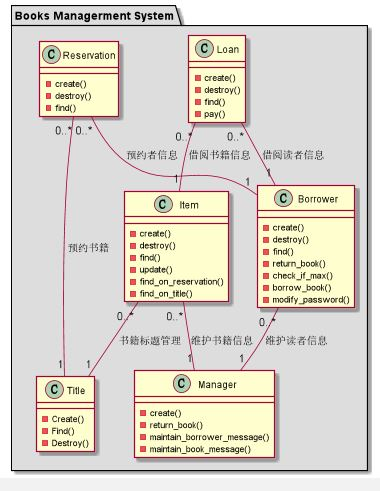
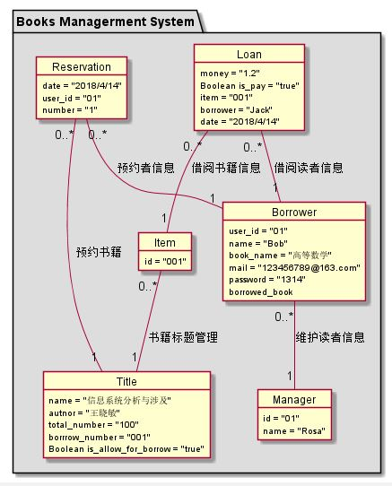

# 1.图书管理系统的类图
## 1.1 类图PlantUML源代码：
```
@startuml
package "Books Managerment System" #DDDDDD{
class Item {
  -create()
  -destroy()
  -find()
  -update()
  -find_on_reservation()
  -find_on_title()
}
class Title {
  -Create()
  -Find()
  -Destroy()
}
class Loan {
   -create()
    -destroy()
    -find()
    -pay()
}
class Reservation {
   -create()
    -destroy()
    -find()
}
class Manager{
     -create()
     -return_book()
     -maintain_borrower_message()
     -maintain_book_message()
 }
class Borrower {
   -create()
    -destroy()
    -find()
    -return_book()
    -check_if_max()
    -borrow_book()
    -modify_password()
}
Item "0..*" -- "1" Title:书籍标题管理
Reservation "0..*" -- "1" Title:预约书籍
Reservation "0..*" -- "1" Borrower:预约者信息
Loan "0..*" -- "1" Borrower:借阅读者信息
Loan "0..*" -- "1" Item:借阅书籍信息
Borrower "0..*" -- "1" Manager:维护读者信息
Item "0..*" -- "1" Manager:维护书籍信息

}
@enduml
```
## 1.2类图如下所示：

## 类图说明：
```
Title：标题类
Ttem：书目类
Reservation：预约类
Borrower：借阅类
Loan：借阅记录类
Manager:管理员类
```
# 2.图书管理系统的对象图
## 2.1 类Item的对象图：
### 源码如下所示：
```
object Item {
  id = "002"
}
```
## 2.2类Reservation的对象图：
### 源码如下所示：
```
object Reservation {
    date = "2018/4/14"
    user_id = "01"
    number = "1"
}
```
## 2.3系统的对象图：
### 源码如下所示：
```
@startuml
package "Books Managerment System" #DDDDDD{
object Item {
  id = "002"
}
object Title {
  name = "信息系统分析与涉及"
  autnor = "罗廷方"
  total_number = "100"
  borrrow_number = "001"
  Boolean is_allow_for_borrow = "true"
}
object Loan {
   money = "1.2"
   Boolean is_pay = "true"
   item = "001"
   borrower = "Jack"
   date = "2018/4/15"
}
object Reservation {
    date = "2018/4/15"
    user_id = "01"
    number = "1"
}
object Borrower {
 user_id = "01"
 name = "luotf"
 book_name = "C语言程序设计"
 mail = "849673404@qq.com"
 password = "1314"
 borrowed_book
}
object Manager{
    id = "01"
    name = "Rosa"
}
Item "0..*" -- "1" Title:书籍标题管理
Reservation "0..*" -- "1" Title:预约书籍
Reservation "0..*" -- "1" Borrower:预约者信息
Loan "0..*" -- "1" Borrower:借阅读者信息
Loan "0..*" -- "1" Item:借阅书籍信息
Borrower "0..*" -- "1" Manager:维护读者信息
}
@enduml
```

