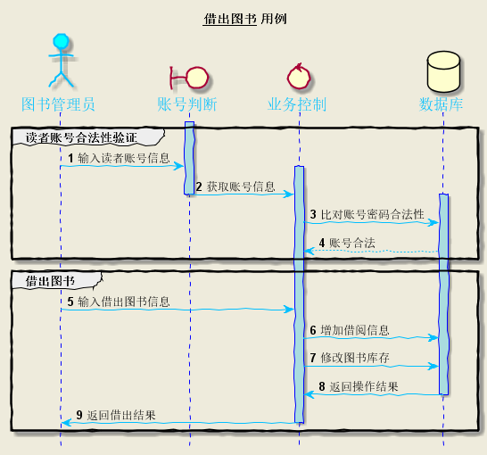
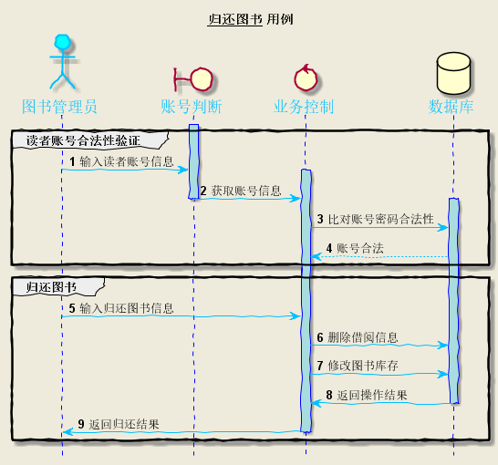
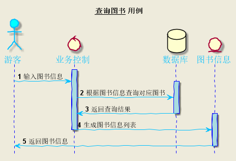
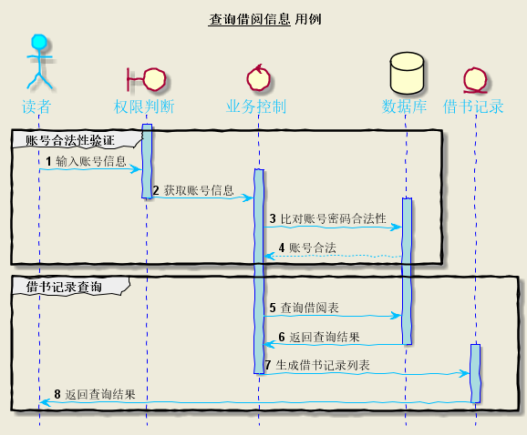

## 1.借出图书
### 1.1 借出图书用例PlantUML源码
```
@startuml
skinparam backgroundColor #EEEBDC
skinparam handwritten true

skinparam sequence {
	ArrowColor DeepSkyBlue
	ActorBorderColor DeepSkyBlue
	LifeLineBorderColor blue
	LifeLineBackgroundColor #A9DCDF
	
	ParticipantBorderColor DeepSkyBlue
	ParticipantBackgroundColor DodgerBlue
	ParticipantFontName Impact
	ParticipantFontSize 17
	ParticipantFontColor #A9DCDF
	
	ActorBackgroundColor aqua
	ActorFontColor DeepSkyBlue
	ActorFontSize 17
	ActorFontName Aapex
}

hide footbox
title __借出图书__ 用例
actor 图书管理员 
boundary 账号判断
control 业务控制
database 数据库


autonumber
group 读者账号合法性验证
activate 账号判断
	图书管理员 -> 账号判断 :  输入读者账号信息
	activate 业务控制
		账号判断 -> 业务控制 : 获取账号信息
deactivate 账号判断
		activate 数据库
			业务控制 -> 数据库 : 比对账号密码合法性
			数据库 --> 业务控制 : 账号合法
end
group 借出图书
			图书管理员 -> 业务控制 : 输入借出图书信息
			业务控制 -> 数据库 : 增加借阅信息
			业务控制 -> 数据库 : 修改图书库存
			数据库 -> 业务控制 : 返回操作结果
		deactivate 数据库
	业务控制 -> 图书管理员 : 返回借出结果
	deactivate 业务控制
	

end

@enduml
```
### 1.2 借出图书用例顺序图



### 1.3 借出图书用例顺序图说明 
```
1.参与者：图书管理员(actor)、账号判断(boundary)、业务控制(control)、数据库(database)。 
2.消息：
      (1)读者账号合法性判断：输入读者账号信息->获取账号信息->对比账号密码合法性->账号合法 
      (2)借出图书：输入借出图书信息->增加借阅信息->修改图书库存->返回借出结果
```
## 2.归还图书
### 2.1 归还图书用例PlantUML源码
```
@startuml
skinparam backgroundColor #EEEBDC
skinparam handwritten true

skinparam sequence {
	ArrowColor DeepSkyBlue
	ActorBorderColor DeepSkyBlue
	LifeLineBorderColor blue
	LifeLineBackgroundColor #A9DCDF
	
	ParticipantBorderColor DeepSkyBlue
	ParticipantBackgroundColor DodgerBlue
	ParticipantFontName Impact
	ParticipantFontSize 17
	ParticipantFontColor #A9DCDF
	
	ActorBackgroundColor aqua
	ActorFontColor DeepSkyBlue
	ActorFontSize 17
	ActorFontName Aapex
}

hide footbox
title __归还图书__ 用例
actor 图书管理员 
boundary 账号判断
control 业务控制
database 数据库


autonumber
group 读者账号合法性验证
activate 账号判断
	图书管理员 -> 账号判断 :  输入读者账号信息
	activate 业务控制
		账号判断 -> 业务控制 : 获取账号信息
deactivate 账号判断
		activate 数据库
			业务控制 -> 数据库 : 比对账号密码合法性
			数据库 --> 业务控制 : 账号合法
end
group 归还图书
			图书管理员 -> 业务控制 : 输入归还图书信息
			业务控制 -> 数据库 : 删除借阅信息
			业务控制 -> 数据库 : 修改图书库存
			数据库 -> 业务控制 : 返回操作结果
		deactivate 数据库
	业务控制 -> 图书管理员 : 返回归还结果
	deactivate 业务控制
	

end

@enduml
```
### 2.2 归还图书用例顺序图



### 2.3 归还图书用例顺序图说明 
```
1.参与者：图书管理员(actor)、账号判断(boundary)、业务控制(control)、数据库(database)。 
2.消息：
      (1)读者账号合法性判断：输入读者账号信息->获取账号信息->对比账号密码合法性->账号合法 
      (2)归还图书：输入归还图书信息->删除借阅信息->修改图书库存->返回操作结果->返回归还结果
```
## 3.查询图书
### 3.1 查询图书用例PlantUML源码
```
@startuml
skinparam backgroundColor #EEEBDC
skinparam handwritten true

skinparam sequence {
	ArrowColor DeepSkyBlue
	ActorBorderColor DeepSkyBlue
	LifeLineBorderColor blue
	LifeLineBackgroundColor #A9DCDF
	
	ParticipantBorderColor DeepSkyBlue
	ParticipantBackgroundColor DodgerBlue
	ParticipantFontName Impact
	ParticipantFontSize 17
	ParticipantFontColor #A9DCDF
	
	ActorBackgroundColor aqua
	ActorFontColor DeepSkyBlue
	ActorFontSize 17
	ActorFontName Aapex
}

hide footbox
title __查询图书__ 用例
actor 游客 
control 业务控制
database 数据库
entity 图书信息

autonumber

activate 业务控制
	游客 -> 业务控制 :  输入图书信息
		activate 数据库
			业务控制 -> 数据库 : 根据图书信息查询对应图书
			数据库 -> 业务控制 : 返回查询结果
		deactivate 数据库
		activate 图书信息
			业务控制 -> 图书信息 : 生成图书信息列表
		deactivate 业务控制
			图书信息 -> 游客	: 返回图书信息
		deactivate 图书信息

@enduml
```
### 3.2 查询图书用例顺序图



### 3.3 查询图书用例顺序图说明 
```
1.参与者：游客(actor)、业务控制(control)、数据库(database)、图书信息(entity)。 
2.消息：输入图书信息->根据图书信息查询对应图书->返回查询结果->生成图书信息列表->返回图书信息
```
## 4.查询借阅信息
### 4.1 查询借阅信息用例PlantUML源码
```
@startuml
skinparam backgroundColor #EEEBDC
skinparam handwritten true

skinparam sequence {
	ArrowColor DeepSkyBlue
	ActorBorderColor DeepSkyBlue
	LifeLineBorderColor blue
	LifeLineBackgroundColor #A9DCDF
	
	ParticipantBorderColor DeepSkyBlue
	ParticipantBackgroundColor DodgerBlue
	ParticipantFontName Impact
	ParticipantFontSize 17
	ParticipantFontColor #A9DCDF
	
	ActorBackgroundColor aqua
	ActorFontColor DeepSkyBlue
	ActorFontSize 17
	ActorFontName Aapex
}

hide footbox
title __查询借阅信息__ 用例
actor 读者 
boundary 权限判断
control 业务控制
database 数据库
entity 借书记录

autonumber
group 账号合法性验证
activate 权限判断
	读者 -> 权限判断 :  输入账号信息
	activate 业务控制
		权限判断 -> 业务控制 : 获取账号信息
deactivate 权限判断
		activate 数据库
			业务控制 -> 数据库 : 比对账号密码合法性
			数据库 --> 业务控制 : 账号合法
end
group 借书记录查询
	业务控制 -> 数据库 : 查询借阅表
	数据库 -> 业务控制 : 返回查询结果
	deactivate 数据库
	activate 借书记录
		业务控制 -> 借书记录 : 生成借书记录列表
	deactivate 业务控制
		借书记录 -> 读者 : 返回查询结果
	deactivate 借书记录
	
end
@enduml
```

### 4.2 查询借阅信息用例顺序图



### 4.3 查询借阅信息用例顺序图说明 
```
1.参与者：读者(actor)、权限判断(boundary)、业务控制(control)、数据库(database)、借书记录(entity)。 
2.消息：
      (1)账号合法性判断：输入账号信息->获取账号信息->对比账号密码合法性->账号合法 
      (2)借书记录：查询借阅表->返回查询结果->生成借书记录列表->返回查询结果
```
