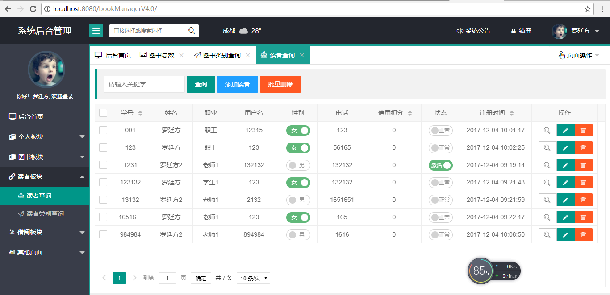

# 实验5：图书管理系统数据库设计与界面设计
## 1.数据库表设计

### 1.1. 图书表


### 1.2. 读者表


### 1.3. 管理员表


### 1.4. 借阅归还表


### 1.5. 读者类别表


### 1.6. 图书类别表

## 2. 界面设计

### 2.1. 首页设计


### 2.2 图书查询界面及API

- API接口如下：
- 功能：用于获取所有图书信息
- 请求地址： http://localhost:8080/bookManagerV4.0/page/book/findBook.html?all
- 请求方法：POST
- 请求参数：pageNow: 1,pageSize: 10

|参数名称|必填|说明|
|:-------:|:-------------: | :----------:|
|pageNow|是|当前页|
|pageSize|是|每页的数量|

- 返回实例：
```
{
    code:0
    count:44
    "data": 
    [
      0:{
          author:"罗廷方1"
          bookName:"Java"
          bookNo:"0881"
          introduction:"《你是人间四月天》收录了林徽因几乎所有的诗歌、散文、小说。"
          lastTime:{date: 6, day: 3, hours: 10, minutes: 17, month: 11, nanos: 0, seconds: 53, time: 1512526673000,…}
          num:84
          photo:[-1, -40, -1, -32, 0, 16, 74, 70, 73, 70, 0, 1, 1, 1, 0, 72, 0, 72, 0, 0, -1, -37, 0, 67, 0, 9, 6, 7,…]
          price:595
          publish:"成都大学出版社"
          publishDate:{date: 4, day: 1, hours: 20, minutes: 52, month: 11, nanos: 0, seconds: 15, time: 1512391935000,…}
          snum:80
          },
       1:{...},
       2:{...},
    ]
}
```
- 返回参数说明：
    
|参数名称|说明|
|:-------:|:-------------: |
|count|查询数的总数|
|data|书籍的详细信息|

### 2.3 编辑图书界面及API

- 功能：修改图书的信息
- 请求地址： http://localhost:8080/bookManagerV4.0/page/book/updateBook.html?book.bookNo=123
- 请求方法：POST
- 请求参数：
```
      bookNo: 123
      book.bookNo: 123
      book.bookName: JavaEE
      book.bookType.id: 23
      book.price: 14
      book.snum: 81
      book.num: 16
      book.author: 罗廷方2
      book.publishDate: 2017-12-17 16:03:51
      book.publish: 成都大学出版社
      book.introduction: 《你是人间四月天》收录了林徽因几乎所有的诗歌、散文、小说。

```
- 返回实例：
```
{
   "1"
}
```
- 返回参数说明：
    
|参数名称|说明|
|:-------:|:-------------: |
|1|成功|

### 2.4 查询所有图书类别及API

- 功能：查询所有图书类别及其信息
- 请求地址： http://localhost:8080/bookManagerV4.0/page/book/findBookType.html
- 请求方法：POST
- 请求参数：pageNow: 1,pageSize: 10

|参数名称|必填|说明|
|:-------:|:-------------: | :----------:|
|pageNow|是|当前页|
|pageSize|是|每页的数量|

- 返回实例：
```
{
    code:0
    count:5
    "data": 
    [
      0:{
          addTime:{date: 4, day: 1, hours: 20, minutes: 52, month: 11, nanos: 0, seconds: 48, time: 1512391968000,…}
          bookTypeName:"计算机"
          id:21
          lastTime:{date: 4, day: 1, hours: 20, minutes: 52, month: 11, nanos: 0, seconds: 48, time: 1512391968000,…}
          num:49
          },
       1:{...},
       2:{...},
    ]
}
```
- 返回参数说明：
    
|参数名称|说明|
|:-------:|:-------------: |
|count|查询数的总数|
|data|书籍类别的详细信息|

### 2.5 查询所有读者界面及API

- 功能：查询所有读者及其信息
- 请求地址： http://localhost:8080/bookManagerV4.0/page/reader/findReader.html?all
- 请求方法：POST
- 请求参数：pageNow: 1,pageSize: 10

|参数名称|必填|说明|
|:-------:|:-------------: | :----------:|
|pageNow|是|当前页|
|pageSize|是|每页的数量|

- 返回实例：
```
{
    code:0
    count:5
    "data": 
    [
      0:{
          addTime:{date: 4, day: 1, hours: 10, minutes: 1, month: 11, nanos: 0, seconds: 17, time: 1512352877000,…}
          address:"123"
          credit:0
          email:"849673404@qq.com"
          lastTime:{date: 25, day: 1, hours: 17, minutes: 24, month: 11, nanos: 0, seconds: 35, time: 1514193875000,…}
          password:"123"
          photo:[-1, -40, -1, -32, 0, 16, 74, 70, 73, 70, 0, 1, 1, 1, 0, 96, 0, 96, 0, 0, -1, -31, 0, 34, 69, 120, 105,…]
          readerName:"罗廷方"
          readerNo:"001"
          readerType:{,…}
          sex:"女"
          status:1
          telephone:"123"
          username:"12315"
          },
       1:{...},
       2:{...},
    ]
}
```
- 返回参数说明：
    
|参数名称|说明|
|:-------:|:-------------: |
|count|查询数的总数|
|data|读者的详细信息|

### 2.6 借阅界面设计及API

- 功能：查询所有借阅及其信息
- 请求地址： http://localhost:8080/bookManagerV4.0/page/lend/findLend.html?findLendByReader
- 请求方法：POST
- 请求参数：pageNow: 1,pageSize: 10

|参数名称|必填|说明|
|:-------:|:-------------: | :----------:|
|pageNow|是|当前页|
|pageSize|是|每页的数量|

- 返回实例：
```
{
    code:0
    count:3
    "data": 
    [
      0:{
          bookNo:{
                  addTime:{date: 4, day: 1, hours: 10, minutes: 1, month: 11, nanos: 0, seconds: 17, time: 1512352877000,…}
                  address:"123"
                  credit:0
                  email:"849673404@qq.com"
                  lastTime:{date: 25, day: 1, hours: 17, minutes: 24, month: 11, nanos: 0, seconds: 35, time: 1514193875000,…}
                  password:"123"
                  photo:[-1, -40, -1, -32, 0, 16, 74, 70, 73, 70, 0, 1, 1, 1, 0, 96, 0, 96, 0, 0, -1, -31, 0, 34, 69, 120, 105,…]
                  readerName:"罗廷方"
                  readerNo:"001"
                  readerType:{,…}
                  sex:"女"
                  addTime:{date: 4, day: 1, hours: 20, minutes: 52, month: 11, nanos: 0, seconds: 18, time: 1512391938000,…}
                  author:"罗廷方1"
                  bookName:"Java"
                  bookNo:"0881"
                  bookType:{,…}
                  introduction:"《你是人间四月天》收录了林徽因几乎所有的诗歌、散文、小说。"
                  lastTime:{date: 6, day: 3, hours: 10, minutes: 17, month: 11, nanos: 0, seconds: 53, time: 1512526673000,…}
                  num:84
                  photo:[-1, -40, -1, -32, 0, 16, 74, 70, 73, 70, 0, 1, 1, 1, 0, 72, 0, 72, 0, 0, -1, -37, 0, 67, 0, 9, 6, 7,…]
                  price:595
                  publish:"成都大学出版社"
                  publishDate:{date: 4, day: 1, hours: 20, minutes: 52, month: 11, nanos: 0, seconds: 15, time: 1512391935000,…}
                  snum:80
                  }
          id:21
          borrowDate:{date: 25, day: 1, hours: 10, minutes: 4, month: 11, nanos: 0, seconds: 51, time: 1514167491000,…}
          readerNo:{
                   addTime:{date: 4, day: 1, hours: 9, minutes: 19, month: 11, nanos: 0, seconds: 14, time: 1512350354000,…}
                   address:"1321321"
                   credit:0
                   email:"132132@qq.com"
                   lastTime:{date: 7, day: 1, hours: 17, minutes: 44, month: 4, nanos: 0, seconds: 39, time: 1525686279000,…}
                   password:"32132"
                   photo:[-1, -40, -1, -32, 0, 16, 74, 70, 73, 70, 0, 1, 1, 1, 0, 96, 0, 96, 0, 0, -1, -31, 0, 34, 69, 120, 105,…]
                   readerName:"罗廷方2"
                   readerNo:"1231"
                   readerType:{,…}
                   sex:"男"
                   status:0
                   telephone:"132132"
                   username:"132132"
          }
          returnDate:{date: 24, day: 3, hours: 10, minutes: 4, month: 0, nanos: 0, seconds: 51, time: 1516759491000,…}
          },
       1:{...},
       2:{...},
    ]
}
```
- 返回参数说明：
    
|参数名称|说明|
|:-------:|:-------------: |
|count|查询数的总数|
|data|借阅的详细信息|
