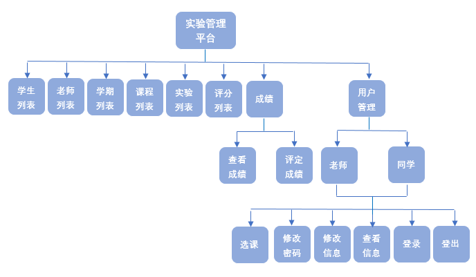

## 1.系统总体结构

## 2.界面设计

## 3.用例图设计 源码

## 4.类图设计 源码

## 5.数据库设计 源码
- ### [参见数据库设计](数据库设计.md)

## 6.用例及界面详细设计
- ### [“学生列表”用例](数据库设计.md)
- ### [“老师列表”用例](数据库设计.md)
- ### [“学期列表”用例](数据库设计.md)
- ### [“课程/实验/评分列表”用例](数据库设计.md)
- ### [“查看成绩”用例](数据库设计.md)
- ### [“评定成绩”用例](数据库设计.md)
- ### [“查看学生信息”用例](数据库设计.md)
- ### [“修改学生信息”用例](数据库设计.md)
- ### [“查看老师信息”用例](数据库设计.md)
- ### [“修改老师信息”用例](数据库设计.md)
- ### [“修改密码”用例](数据库设计.md)
- ### [“登录”用例](数据库设计.md)
- ### [“登出”用例](数据库设计.md)
